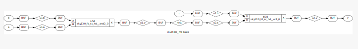

# VSD RTL design workshop with sky130 Technology
A 5-day workshop conducted by VSD on the topic of RTL design using sky130 Technology.


https://www.vlsisystemdesign.com/rtl-design-using-verilog-with-sky130-technology/
# Day 1 

## Contents 
1. Introduction to technology library file  
2. Lab Session 1 - Hierachal and Flatten synthesis
3. Lab Session 2 - Flip-Flop implementatation and synthesis 


# Day 2 

## Contents 
1. Introduction to technology library file  
2. Lab Session 1 - Hierachal and Flatten synthesis
3. Lab Session 2 - Flip-Flop implementatation and synthesis 

 The steps followed is similar to Example 1 as described below, 
- Input the RTL verilog code and testbench to iVerilog
- Output obtained is visualised in gtk and check the functionality
- Perform synthesis and generate netlist.
- Input the netlist, verilog models and testbenct to iVerilog
- Check the output waveform in gtk and compare with pre-synthesis RTL code. 


## 2. Lab Session 1 - Hierachal and Flatten synthesis
### Example 1 
Consider the combinational circuit described below, 


The combination circuit consists of two submodules. <br/>
1. Submodule U1 : Consists of a AND gate with A and B as inputs. 
2. Submodule U2 : Consists of a OR gate having inputs C and output from submodule U1. 

The logical expression for the above combinational circuit is given by, <br/>


The verilog code of the above combinational circuit with two submodules is shown below 
```SystemVerilog
module sub_module2 (input a, input b, output y);
	assign y = a | b;
endmodule

module sub_module1 (input a, input b, output y);
	assign y = a&b;
endmodule

module multiple_modules (input a, input b, input c , output y);
	wire net1;
	sub_module1 u1(.a(a),.b(b),.y(net1));  //net1 = a&b
	sub_module2 u2(.a(net1),.b(c),.y(y));  //y = net1|c ,ie y = a&b + c;
endmodule
```
Next, the simulation of the verilog code, synthesis and generation of the netlist is done by the following steps, 
#### 1. Execute the verilog code in iverlog 
 <pre><code>
 <strong>iverilog</strong> multiple_modules.v tb_multiple_modules.v <br/>
 ./a.out<br/>
 <strong>gtkwave</strong> multiple_modules.vcd <br/>
 </code></pre>


The output obtained for the functionality with verilog code in GTKwave is shown below,


It is seen that the output waverform of Y of the combinational circuit is correct for the logical expression as stated earlier. 

#### 2. Perform Synthesis in Yosys
 <pre><code>
 <strong>yosys</strong> <br/>
 <strong>read_liberty</strong> -lib ../../sky130_fd_sc_hd__tt_025C_1v80.lib <br/>
 <strong>read_verilog</strong> multiple_modules.v <br/>
 <strong>synth</strong> -top multiple_modules <br/>
 </code></pre>


From the above output log after synthesis, the design hierachy shows two sub modules , submodule_1 and submodule_2.
#### 3. Generate netlist and save the verilog file after synthesis 
 <pre><code>
 <strong>abc</strong> -liberty ../my_lib/lib/sky130_fd_sc_hd__tt_025C_1v80.lib <br/>
 <strong>show</strong><br/>
 <strong>write_verilog</strong> -noattr multiple_modules.v_netlist.v <br/>
 </code></pre>
 


The schematic of the netlist shows two sub modules submodule 1 and submodule 2 and do not show the underlying cells of AND and OR gate.<br/> 
The comparison between the intial verilog code and verilog code obtained from the netlist is shown below, 


The hierachal modules are preserved in the code generated from netlist similar to the reference verilog code. 


### Example 2
In this example, the test of flattening the heirachal verilog code is done.  
The combination circuit consists of two submodules similar to Example 1. <br/>
1. Submodule U1 : Consists of a AND gate with A and B as inputs. 
2. Submodule U2 : Consists of a OR gate having inputs C and output from submodule U1.  

The verilog code of the above combinational circuit with two submodule is similar to the example 1 <br/>

The simulation of the verilog code, synthesis, generation of the netlist and flattening are done by the following steps, 
#### 1. Execute the verilog code in iverlog 
 <pre><code>
 <strong>iverilog</strong> multiple_modules.v tb_multiple_modules.v <br/>
 </code></pre>

#### 2. Perform Synthesis in Yosys
 <pre><code>
 <strong>yosys</strong> <br/>
 <strong>read_liberty</strong> -lib my_lib/lib/sky130_fd_sc_hd__tt_025C_1v80.lib <br/>
 <strong>read_verilog</strong> multiple_modules.v <br/>
 <strong>synth</strong> -top multiple_modules <br/>
 </code></pre>


From the above output log after synthesis, the design hierachy of two sub modules and the corresponding cells are present.

#### 3. Generate netlist, Flatten and save the verilog file of the generated netlist. 
 <pre><code>
 <strong>abc</strong> -liberty ../my_lib/lib/sky130_fd_sc_hd__tt_025C_1v80.lib<br/>
 <strong>flatten</strong>
 <strong>show</strong>
 <strong>write_verilog</strong> -noattr multiple_modules_netlist.v  <br/>
 </code></pre>
 


The schematic of the netlist now shows the entire structure of the combination network with standard cells. <br/>
The comparison between the intial verilog code and verilog code obtained from the netlist is shown below, 


The hierachal modules are not preserved in the code generated from the netlist after flattening in comparison to the reference verilog code. 


### Example 3
In this example, the test of synthesis of a submodule is done.  
The combination circuit consists of two submodules similar to Example 1 and 2. <br/>
1. Submodule U1 : Consists of a AND gate with A and B as inputs - We will only do synthesis of this submodule.
2. Submodule U2 : Consists of a OR gate having inputs C and output from submodule U1.  

The simulation of the verilog code, synthesis and generation of the netlist are done by the following steps, 
#### 1. Execute the verilog code in iverlog 
 <pre><code>
 <strong>iverilog</strong> multiple_modules.v tb_multiple_modules.v <br/>
 </code></pre>

#### 2. Perform Synthesis of the submodule 1 in Yosys
 <pre><code>
 <strong>yosys</strong> <br/>
 <strong>read_liberty</strong> -lib my_lib/lib/sky130_fd_sc_hd__tt_025C_1v80.lib <br/>
 <strong>read_verilog</strong> multiple_modules.v <br/>
 <strong>synth</strong> -top sub_module1 <br/>
 </code></pre>


From the above output log after synthesis, it is seen that only submodule 1 haaving AND gates are inferred. 

#### 3. Generate netlist  
 <pre><code><strong>abc</strong> -liberty ../my_lib/lib/sky130_fd_sc_hd__tt_025C_1v80.lib</code></pre>   
 <pre><code><strong>write_verilog</strong> -noattr ternary_operator_mux_netlist.v </code></pre>
 <pre><code><strong>show</strong></code></pre>
 


The schematic of the netlist now shows only the AND gate from the submodule 1. 
The synthesis of submodules in large design help to reduce the time taken in the synthesis of large designs.<br/>   


In this next examples, the test of different D-flip flop configurations as mentioned below are done. 
1. Asynchronus Reset D-flip flop 
2. Asynchronus Set D-flip flop 
3. Synchronus Reset D-flip flop 

A schematic of the three different D-flip flop elements is shown below,  <br/>


### Example 4

1. Asynchronus Reset D-flip flop :
In a D-Flip flop with asynchronus reset, the output Q of the flop will go to active low when reset is low regardless of the clockedge.
The verilog code of an Asynchronus Reset D-flip flop is shown below, 
```SystemVerilog
module dff_asyncres ( input clk ,  input async_reset , input d , output reg q );
always @ (posedge clk , posedge async_reset)
begin
	if(async_reset)
		q <= 1'b0;
	else	
		q <= d;
end
endmodule

```
The simulation of the verilog code, synthesis and generation of the netlist are done by the following steps, 
#### 1. Execute the verilog code in iverlog 
<pre><code><strong>iverilog</strong> ternary_operator_mux.v tb_ternary_operator.v</code></pre>   
<pre><code>./a.out</code></pre>
<pre><code><strong>gtkwave</strong> tb_ternary_operator_mux.vcd</code></pre>


The output obtained for the functionality with verilog code in GTKwave is shown below,


#### 2. Perform Synthesis of the submodule 1 in Yosys
 <pre><code><strong>yosys</strong> </code></pre>   
 <pre><code><strong>read_liberty</strong> -lib my_lib\lib\sky130_fd_sc_hd__tt_025C_1v80.lib </code></pre>
 <pre><code><strong>read_verilog</strong> ternary_operator_mux.v</code></pre>
 <pre><code><strong>synth</strong> synth -top ternary_operator_mux</code></pre>


From the above output log after synthesis, it is seen that AND gate is inferred. 

#### 3. Generate netlist  
 <pre><code><strong>abc</strong> -liberty ../my_lib/lib/sky130_fd_sc_hd__tt_025C_1v80.lib</code></pre>   
 <pre><code><strong>write_verilog</strong> -noattr ternary_operator_mux_netlist.v </code></pre>
 <pre><code><strong>show</strong></code></pre>
 


The schematic of the netlist now shows only the AND gate from the submodule 1. 
The synthesis of submodules in large design help to reduce the time taken in the synthesis of large designs.  

### Example 5

Asynchronus Set D-flip flop :
In a D-Flip flop with asynchronus reset, the output Q of the flop will go to active low when reset is low regardless of the clockedge.
The verilog code of an Asynchronus Reset D-flip flop is shown below, 
```SystemVerilog
module dff_asyncres ( input clk ,  input async_reset , input d , output reg q );
always @ (posedge clk , posedge async_reset)
begin
	if(async_reset)
		q <= 1'b0;
	else	
		q <= d;
end
endmodule

```

### Example 6
Synchronus Reset D-flip flop :
In a D-Flip flop with asynchronus reset, the output Q of the flop will go to active low when reset is low regardless of the clockedge.
The verilog code of an Asynchronus Reset D-flip flop is shown below, 
```SystemVerilog
module dff_asyncres ( input clk ,  input async_reset , input d , output reg q );
always @ (posedge clk , posedge async_reset)
begin
	if(async_reset)
		q <= 1'b0;
	else	
		q <= d;
end
endmodule

```


# Day 3 

## Contents 
1. Introduction to optimisation 
2. Lab Session - Combinational logic optimisation
3. Lab Session - Sequential logic optimisation

## 1. Introduction to optimisation : 
   Combinational logic optimisation is needed in a digital circuit design for the following main reasons, 
   - To minimise the area and power consumption.
   - Direct 
   - Reducing the number of gates by optimising the boolean logic using K-Map or 

### Constant propogation : 
Consider the following example of a combinational logic network in Figure 3.1a. 


The output is given by,


The combinational network reduces to a NOT gate after direct optimisation as shown in Figure 3.1b and Figure 3.1c.
The circuit implementation of the combinational network and the optimised NOT gate is shown in Figure 3.2


The number of transistor for the implementation after direct optimisation due to constant propogation reduces to 2, in comparison to 6 transistor required for the combinational network. 

### Boolean logic optimisation :

Consider the following boolean expression, 


The combinational logic network is shown in Figure 3.3. It consists of 3 MUX having select inputs c, b and a from left to right. The final output is obtained at the third MUX. 


The boolean logic optimisation at each MUX are done as follows, 
At MUX 1, 


At MUX 2, 


At MUX 3, The final output is optimised as below, 


Thus, the boolean expression implemented by a combinational network of 3 MUX are optimised to a NOR gate.
The synthesis tool takes into account these steps to provide an optimised combination network for reducing power and area. 

### Sequential logic optimisation :
The techniques for sequential logic optimisation are described below, 
- Sequential constant propogation (Basic) 
- State optimisation
- Retiming 
- Sequential logic cloning (In Floor plan aware) 

### Sequential constant optimisation: 
Consider the example below of a sequential logic with a D-Flop as shown below, 


The logical expression for 
RST = 1, Q = 0 
RST = 0, Q = 0 (since D = 0) 
Y = A0 = A + 0 = A + 1 

In this case it is seen that irrespective of the RST and Clk the output Y is always 1. 
Hence, 

Consider the same sequential with Reset signal replaced with a set signal as below, 

In the above case, the sequential logic cannot be optimised and the D-flop is needed for the logic network. 
Hence, it does not have a sequential constant as compared in example in Figure 3_2. 

Lab


# Day 4 

## Contents 
1. Verification of Gate level Synthesized netlist  
2. Lab Session - Combinational logic optimisation
3. Lab Session - Sequential logic optimisation

## 1. Verification of Gate level Synthesized (GLS) netlist : 
In the Gate level synthesis, the netlist obtained as the output after synthesis is used as the Design under test (DUT) 
The test bench developed for the RTL design code is used for also testing the logical functionality of the netlist. 
GLS is required to verify the logical correctness and ensuring timing specification are met after synthesis.  

The flow diagram of the GLS setup with iVerilog is shown in Figure 4.1


The input to the iverilog is the Netlist generated after synthesis, gate level verilog models and test bench. 
The output of iverilog is the value change dump. The output vcd file is loaded in the GTK waver to check the logical correctness. 
If the timing constraint is given in the 
In the next step, a comparison between a RTL design code and netlist is discussed. 
Consider an example of a combinational network as shown in Figure 4.2. 


The RTL verilog code for the above combinational network is shown below, 


The netlist obtained from the synthesis tool is shown below, 


The testing and comparison of the RTL verilog code and netlist code can help to find and debug any functionality errors.
This improves the quality of the synthesised netlist before the place and route process. 

The mismatch found during the simulations tests done with the synthesised netlist can due to the following reasons,
- Missing sensitivity list 
- Blocking versus non-blocking assignments 
- Non verilog standard coding. 

### Missing sensitivity list 
In the verilog simulator, one of the key parameters that the simulator takes into account is the presence of acitivity, If there is no acitvity in the inputs, the 
Consider the following verilog code, 


In this functionality of the MUX defined in the verilog code, the select input connects the input i0 and i1. 
The output waveform of the above functionality defined in verilog is shown in the 

The conditional statement defined by always (@sel) is only executed when sel is 0 or 1. 
However, always block is not executed 


This can be corrected by evaluating the function with the change of any signal .
The corrected verilog code is shown below, 


Thus the simulation will be corrected as below.


## 2. Lab 1 GLS Synthesis simulation mismatch : 
### Example 1
In this test, the following steps are done, 
- Input the RTL verilog code and testbench to iVerilog
- Output obtained is visualised in gtk and check the functionality
- Perform synthesis and generate netlist.
- Input the netlist, verilog models and testbenct to iVerilog
- Check the output waveform in gtk and compare with pre-synthesis RTL code.  

Verilog code of the RTL design having a 2x1 MUX in this example is shown below, 

```SystemVerilog
module ternary_operator_mux (input i0 , input i1 , input sel , output y);
assign y = sel?i1:i0;
endmodule
```
#### 1. Check the functionality of the verilog code of the RTL Design
-  To check the RTL design with the testbench 
 <pre><code><strong>iverilog</strong> ternary_operator_mux.v tb_ternary_operator.v</code></pre>   
-   To create a vcd dump file 
 <pre><code>./a.out</code></pre>
-   Open gtk wave
 <pre><code><strong>gtkwave</strong> tb_ternary_operator_mux.vcd</code></pre>


The output obtained for the MUX functionality with verilog code in GTKwave is shown below,


The logical functionality of the 2x1 MUX is found to be correct. 
- Select input sel = 1, Output Y = i0 
- Select input sel = 0, Output Y = i1

#### 2. Perform Synthesis in Yosys
-  Invoke yosys 
 <pre><code><strong>yosys</strong> </code></pre>   
-  Read liberty file 
 <pre><code><strong>read_liberty</strong> -lib my_lib\lib\sky130_fd_sc_hd__tt_025C_1v80.lib </code></pre>
-  Read Verilog File 
 <pre><code><strong>read_verilog</strong> ternary_operator_mux.v</code></pre>
-  Perform synthesis 
 <pre><code><strong>synth</strong> -top ternary_operator_mux</code></pre>


From the above output log after synthesis, the obtained inferred cell is a MUX

#### 3. Generate netlist and save the verilog file after synthesis 
-  Generate netlist 
 <pre><code><strong>abc</strong> -liberty ../my_lib/lib/sky130_fd_sc_hd__tt_025C_1v80.lib</code></pre>   
-  write verilog file
 <pre><code><strong>write_verilog</strong> -noattr ternary_operator_mux_netlist.v </code></pre>
-  Show the schematic
 <pre><code><strong>show</strong></code></pre>
 


From the graphical representation of the netlist the obtained cell is mux2_1

#### 4. Use the synthesised netlist, library verilog models, testbench and check the functionality in iverilog 
-  To check the functionality of the synthesised netlist  
 <pre><code><strong>iverilog</strong> my_lib\verilog_model\primitives.v my_lib\verilog_model\sky130_fd_sc_hd.v ternary_operator_mux_netlist.v tb_ternary_operator.v</code></pre>  -   To create a vcd dump file 
 <pre><code>./a.out</code></pre>
-   Open gtk wave
 <pre><code><strong>gtkwave</strong> tb_ternary_operator_mux.vcd</code></pre>
 
 
 
 The logical functionality of the verilog of the netlist of 2x1 MUX is found to be correct and similar to pre-synthesis functionality. 
- Select input sel = 1, Output Y = i0 
- Select input sel = 0, Output Y = i1
 
 ### Example 2
 In this test, an example of a verilog code for a 2x1 mux is checked for synthesis simulation mismatch. 
 The steps followed is similar to Example 1 as described below, 
- Input the RTL verilog code and testbench to iVerilog
- Output obtained is visualised in gtk and check the functionality
- Perform synthesis and generate netlist.
- Input the netlist, verilog models and testbenct to iVerilog
- Check the output waveform in gtk and compare with pre-synthesis RTL code. 

Verilog code of the RTL design having a 2x1 MUX in Example 2 is shown below, 

```SystemVerilog
module ternary_operator_mux (input i0 , input i1 , input sel , output y);
assign y = sel?i1:i0;
endmodule
```
#### 1. Check the functionality of the verilog code of the RTL Design
 <pre><code><strong>iverilog</strong> ternary_operator_mux.v tb_ternary_operator.v</code></pre>   
 <pre><code>./a.out</code></pre>
 <pre><code><strong>gtkwave</strong> tb_ternary_operator_mux.vcd</code></pre>


The output obtained for the MUX functionality with verilog code in GTKwave is shown below,


The logical functionality of the 2x1 MUX is found to be correct. 
- Select input sel = 1, Output Y = i0 
- Select input sel = 0, Output Y = i1

#### 2. Perform Synthesis in Yosys
 <pre><code><strong>yosys</strong> </code></pre>   
 <pre><code><strong>read_liberty</strong> -lib my_lib\lib\sky130_fd_sc_hd__tt_025C_1v80.lib </code></pre>
 <pre><code><strong>read_verilog</strong> ternary_operator_mux.v</code></pre>
 <pre><code><strong>synth</strong> -top ternary_operator_mux</code></pre>


From the above output log after synthesis, the obtained inferred cell is a MUX

#### 3. Generate netlist and save the verilog file after synthesis 
 <pre><code><strong>abc</strong> -liberty ../my_lib/lib/sky130_fd_sc_hd__tt_025C_1v80.lib</code></pre>   
 <pre><code><strong>write_verilog</strong> -noattr ternary_operator_mux_netlist.v </code></pre>
 <pre><code><strong>show</strong></code></pre>
 


From the graphical representation of the netlist the obtained cell is mux2_1

#### 4. Use the synthesised netlist, library verilog models, testbench and check the functionality in iverilog  
 <pre><code><strong>iverilog</strong> my_lib\verilog_model\primitives.v my_lib\verilog_model\sky130_fd_sc_hd.v ternary_operator_mux_netlist.v tb_ternary_operator.v</code></pre> 
 <pre><code>./a.out</code></pre>
 <pre><code><strong>gtkwave</strong> tb_ternary_operator_mux.vcd</code></pre>
 
 
 
 The logical functionality of the verilog of the netlist of 2x1 MUX is found to be correct and similar to pre-synthesis functionality. 
- Select input sel = 1, Output Y = i0 
- Select input sel = 0, Output Y = i1

 ## 3. Lab 2 GLS Synthesis simulation mismatch : 
 
 
# Day 5 

## Contents 
1. If-else statement
2. Case Statement 
3. For loop and generate
4. Lab Session 1 - Incomplete If-else
5. Lab Session 2 - Incomplete Case
6. Lab Session 3 - For Loop and generate
 
## 1. If - Else statement
The If-else structure in the verilog code are used to create priority logic. 
The syntax of a If-else structure is shown below, 

```SystemVerilog
if <condition>
   begin
         statement 1;
         statement 2; 
   end
else 
   begin
         statement 1;
         statement 2; 
   end
```
Consider an example of a If-else structure in verilog having three conditions as defined below, 

```SystemVerilog
if <cond_1>
   begin
         A1;
   end
else if <cond_2>
   begin
         A2;
   end
else if <cond_3>
   begin
         A3;
   end
else 
   begin
         A4;
   end
```
Since, If-else statement are evaluated based on priority, first the cond_1 is evaluated.<br/>
If it is true, the output is assigned with the logic of A1.<br/>
If the condition is false, the next condition is evaluated as specified by the else if statement.<br/>
The implementation of the above verilog code in the hardware can be graphically represented as below, 


In the hardware implemented by MUX as shown above, the output of MUX 1 (Y) is selected with A1 if the cond_1 is true.<br/>
If cond_1 is False and cond_2 is True, the output Y is obtained from the input A2 of MUX 2<br/>


One of the issues of using If-else construct, is the problem of inferred latches. <br/>
This error is caused by incomplete If statement as shown in the syntax below, 

```SystemVerilog
if <condition>
   begin
         statement 1;
         statement 2; 
   end
else if <condition>
   begin
         statement 1;
         statement 2; 
   end
```
The hardware implementation of the above verilog code is shown below,<br/> 
Add picture

In the hardware implementation, due to the absence of the else structure ie, cond_1 and cond_2 is false, the output Y will take the previous value of the output. <br/>
This causes the implementation of a latch at the input of MUX 2.<br/>

However, such inferred latches are found to be useful during the implementation of counters. 
An example verilog code implementing a counter is shown below, 

```SystemVerilog
reg[2:0] count
always @(posedge clk, posedge reset)
begin
   if <reset>
      count <= 3'000;
   else if <enable>
      count <= count + 1;
end
```
In the verilog code, there is an incomplete if structure without an else block.<br/>
At the positive edge of the reset the count is assigned to 000.<br/>
In the next condition, if there is enable, the count is increcment to 1.<br/> 
However, if there is no enable, there is no output assigned to count. The scenario is similar to the previous example that leads to the scenario of inferred latch.<br/>
The hardware level implementation of the above verilog code is shown below, <br/> 
Add image!

When the enable is 1, the MUX output is count incremented by 1. But as enable is 0, the 0th input of the MUX signify a inferred latch.<br/> 
In this case, the count will latch on to the previous value, thereby functionality of the counter is still preserved.<br/>  
Hence, inferred latches must not be present in combinational circuit but can be allowed in sequential circuits. 

## 2. Case structure
The case structure is used inside a always block with a register variable.<br/>  
The syntax of a case statement is shown below, 

```SystemVerilog
reg[1:0] sel
always @(*)
begin
   case <sel>
         2'00 : statement 1; 
         2'01 : statement 2; 
         2'10 : statement 2;
         2'11 : statement 2;
   endcase
end
```

Consider a verilog code with a case statment having 4 select conditions as shown below, 

```SystemVerilog
reg[1:0] sel
always @(*)
begin
   case <sel>
         2'00 : C1; 
         2'01 : C2;
         2'10 : C3; 
         2'11 : C4;
   endcase
end
```

The hardware implementation of the above case statement is realised by a 4x1 MUX with sel as the select input as shown below, 


The problems that can arise due to the usage of the case statement are, 
- Incomplete Case statement lead to inferred latches 
   Consider the example below of a case statement, 
   
   ```SystemVerilog
   reg[1:0] sel
   always @(*)
   begin
    case <sel>
         2'00 : C1; 
         2'01 : C2;
    endcase
   end
   ```
   In this case statement, the conditions for sel with 10 and 11 are not defined.  
   This leads to the output value retaining the previous output as it is similar to an inferred latch. 
   One method to avoid inferred latches in a case statement is by using a default statement. <br/> 
   The above case statement having a default case is shown below, 
   ```SystemVerilog
   reg[1:0] sel
   always @(*)
   begin
      case <sel>
         2'00 : C1; 
         2'01 : C2;
         default : statement;
     endcase
   end
   ```
- Partial assignment in the case statement 
   Inferred latches are also formed in case statements having partial assignment. Consider the example below, 
   ```SystemVerilog
   reg[1:0] sel;
   reg x, y;
   always @(*)
   begin
      case <sel>
         2'00 : begin 
                  x = a;
                  y = b;
                end
         2'00 : begin 
                  x = c;
                end
         default : begin 
                     x = d;
                     y = b;
                  end
     endcase
   end
   ```
   The hardware implementation of the above code is described below, <br/>
   Add Image <br/>
   

   It can be seen that in MUX 2 when sel = 01, input 1 of the MUX 2 is not assigned. <br/>
   This can cause an inferred latch at input 1. <br/>
   Thus, the outputs must be assigned in all the segments in the case. <br/>
   
   - Overlapping case statement 
   In the If-else statement, a priority is created and only one condition is executed. <br/>
   However, in a case statement all the conditions of the case are executed. <br/>
   If there is an overlapping case, this could lead to unpredictable outputs as the outputs can be assigned for two case condions. <br/>
   
## 4. Lab Session 1 Incomplete If-Else statement
  - Example 1
    Verilog code of the RTL design used to check the simulation and synthesis of incomplete If-Else statment is shown below, 
   ```SystemVerilog
   module incomp_if (input i0 , input i1 , input i2 , output reg y);
   always @ (*)
      begin
	      if(i0)
	   	y <= i1;
      end
   endmodule
   ```
   #### 1. Execute the verilog code in iverlog 
    <pre><code><strong>iverilog</strong> ternary_operator_mux.v tb_ternary_operator.v</code></pre>   
    <pre><code>./a.out</code></pre>
    <pre><code><strong>gtkwave</strong> tb_ternary_operator_mux.vcd</code></pre>
   Execution 
   
   The output seen in gtkwave
   
   #### 2. Synthesis done in yosys
    <pre><code><strong>iverilog</strong> ternary_operator_mux.v tb_ternary_operator.v</code></pre>   
    <pre><code>./a.out</code></pre>
    <pre><code><strong>gtkwave</strong> tb_ternary_operator_mux.vcd</code></pre>
    
   From the synthesis output, it is seen that the tool has taken inferred a D- latch 
   
   #### 3. Generate netlist and save the verilog file after synthesis 
      <pre><code><strong>abc</strong> -liberty ../my_lib/lib/sky130_fd_sc_hd__tt_025C_1v80.lib</code></pre>   
      <pre><code><strong>write_verilog</strong> -noattr ternary_operator_mux_netlist.v </code></pre>
       <pre><code><strong>show</strong></code></pre>
   
   The netlist show is showing a D-latch. 
   Thus the incompelte If can cause inferred latch. 
   

 - Example 2 (if2)
    Verilog code of the RTL design used to check the simulation and synthesis of incomplete If-Else statment is shown below, 
   ```SystemVerilog
   module incomp_if2 (input i0 , input i1 , input i2 , input i3, output reg y);
   always @ (*)
   begin
   	if(i0)
   		y <= i1;
   	else if (i2)
	   	y <= i3;

   end
   endmodule
   ```
   #### 1. Execute the verilog code in iverlog 
    <pre><code><strong>iverilog</strong> ternary_operator_mux.v tb_ternary_operator.v</code></pre>   
    <pre><code>./a.out</code></pre>
    <pre><code><strong>gtkwave</strong> tb_ternary_operator_mux.vcd</code></pre>
   Execution 
   
   The output seen in gtkwave
   
   #### 2. Synthesis done in yosys
    <pre><code><strong>iverilog</strong> ternary_operator_mux.v tb_ternary_operator.v</code></pre>   
    <pre><code>./a.out</code></pre>
    <pre><code><strong>gtkwave</strong> tb_ternary_operator_mux.vcd</code></pre>
    
   From the synthesis output, it is seen that the tool has taken inferred a D- latch 
   
   #### 3. Generate netlist and save the verilog file after synthesis 
      <pre><code><strong>abc</strong> -liberty ../my_lib/lib/sky130_fd_sc_hd__tt_025C_1v80.lib</code></pre>   
      <pre><code><strong>write_verilog</strong> -noattr ternary_operator_mux_netlist.v </code></pre>
       <pre><code><strong>show</strong></code></pre>
   
   The netlist show is showing a D-latch. 
   Thus the incompelte If can cause inferred latch. 
   

## 4. Lab Session 2 Incomplete Case statement
  - Example 1 (comp_case)
    Verilog code of the RTL design used to check the simulation and synthesis of incomplete case statement is shown below, 
   ```SystemVerilog
   module incomp_if (input i0 , input i1 , input i2 , output reg y);
   always @ (*)
      begin
	      if(i0)
	   	y <= i1;
      end
   endmodule
   ```

## 5. Lab Session 2 Incomplete If-Else statement


